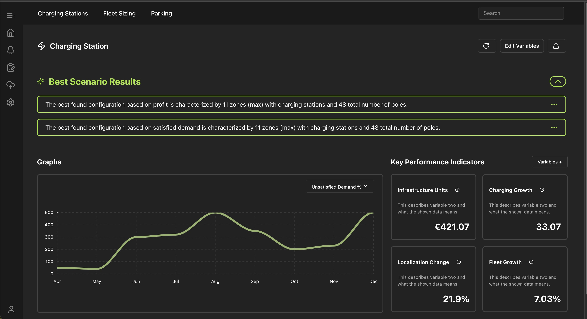

# React + TypeScript + Vite

How to start:

1. `npm i`
2. `npm run dev`

FYI: no auth integrated

## Features Implemented
- Modern Frontend Framework: Leveraging React 18 as the primary UI library for building robust, interactive user interfaces.
- Charting and Data Visualization: Integrating ApexCharts via react-apexcharts to render graph.
- UI Components and Icons:
  - @radix-ui components (e.g., Dialog, Accordion, Tooltip).
  - Lucide-react and @heroicons/react for SVG icons that match various designs.
  - shadcn ui
  - Most icons from https://lucide.dev/icons/info.
- Styling System:
  - Tailwind CSS (with PostCSS and autoprefixer).
  - @material-tailwind/react and @material-tailwind/html to combine Tailwind styling conventions with pre-built interactive components.
- Home page
- Graph tool tip
- Edit siade bar with dynamic buttons, loading 1.5 second

## Mpre about Features:

### Home page:
- Side bar
- Nav bar
- Edit button
- Reusable buttons with shadcn ui
- Graph - I selected a line graph, thinking that it’s more aligned with the overall style compared to what the CSS template had
- Tolltip for grap
- Key preformance indicators - added widths so they remain consistent when the page changes.
  
### Technical Decisions and Trade-offs:
Having only 5 hours, I had very little time to find perfectly matching icons, so the icons you see are as close as possible. I also didn’t have the chance to create an identical search bar. I tried to reuse as many CSS containers and components as possible, but I prioritized speed over reusability.

### Known Limitations:
- Hardcoded variables and categories
- No validation or accessibility enhancements:
- No external state management
- Not adaptable for mobile devices 

### Edit dialog:
- Toggle Sidebar: The sidebar can be opened or closed, and is rendered conditionally based on an isOpen prop.
- Header Buttons (Single Select): Two header buttons ("Autofill" and "Return") can be toggled, ensuring only one is active at a time.
- Multiple Select Ovals: The oval-shaped variable buttons can be selected or deselected independently, allowing multiple simultaneous selections.
- Delayed Tooltip on Hover: Hovering over the "Co2 Distribution" oval button for 1.5 seconds triggers description section. Removing the cursor before the delay elapses prevents the tooltip from showing.

### Technical Decisions and Trade-offs:
- State Management with Hooks: Used React’s useState hook to manage the selected state of both the header buttons and the oval buttons. (Decided on an array-based approach (selectedOvals) for oval selections to allow multiple selections efficiently).
- Styling with CSS: Used a combination of static CSS classes and inline styles for quick adjustments. Classes define the overall look and feel, while inline styles handle small layout tweaks.

### Known Limitations:
- Hardcoded variables and categories
- No validation or accessibility enhancements:
- No external state management
- Not adaptable for mobile devices 

## Time Spent: ~5 hours 
